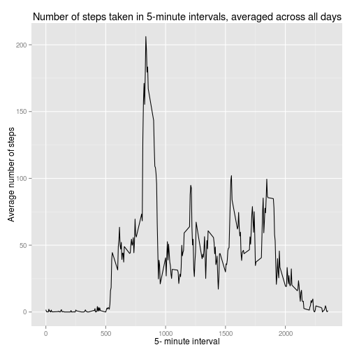
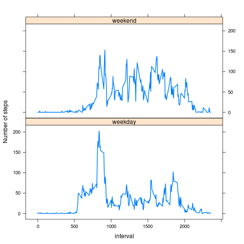

# Reproducible Research: Peer Assessment 1


## Loading and preprocessing the data

1) Load the data into R as a data frame and look at it.

```r
activity = read.csv("activity.csv")
str(activity)
```

```
## 'data.frame':	17568 obs. of  3 variables:
##  $ steps   : int  NA NA NA NA NA NA NA NA NA NA ...
##  $ date    : Factor w/ 61 levels "2012-10-01","2012-10-02",..: 1 1 1 1 1 1 1 1 1 1 ...
##  $ interval: int  0 5 10 15 20 25 30 35 40 45 ...
```

2) Let's convert the date variable from a factor to a date.

```r
activity$date <- as.Date(activity$date)
str(activity)
```

```
## 'data.frame':	17568 obs. of  3 variables:
##  $ steps   : int  NA NA NA NA NA NA NA NA NA NA ...
##  $ date    : Date, format: "2012-10-01" "2012-10-01" ...
##  $ interval: int  0 5 10 15 20 25 30 35 40 45 ...
```

```r
summary(activity)
```

```
##      steps            date               interval   
##  Min.   :  0.0   Min.   :2012-10-01   Min.   :   0  
##  1st Qu.:  0.0   1st Qu.:2012-10-16   1st Qu.: 589  
##  Median :  0.0   Median :2012-10-31   Median :1178  
##  Mean   : 37.4   Mean   :2012-10-31   Mean   :1178  
##  3rd Qu.: 12.0   3rd Qu.:2012-11-15   3rd Qu.:1766  
##  Max.   :806.0   Max.   :2012-11-30   Max.   :2355  
##  NA's   :2304
```


Make a new data frame for total daily steps.

```r
library(plyr)
dailysteps <- ddply(activity, .(date), summarise, totalsteps = sum(steps))
str(dailysteps)
```

```
## 'data.frame':	61 obs. of  2 variables:
##  $ date      : Date, format: "2012-10-01" "2012-10-02" ...
##  $ totalsteps: int  NA 126 11352 12116 13294 15420 11015 NA 12811 9900 ...
```

```r
summary(dailysteps)
```

```
##       date              totalsteps   
##  Min.   :2012-10-01   Min.   :   41  
##  1st Qu.:2012-10-16   1st Qu.: 8841  
##  Median :2012-10-31   Median :10765  
##  Mean   :2012-10-31   Mean   :10766  
##  3rd Qu.:2012-11-15   3rd Qu.:13294  
##  Max.   :2012-11-30   Max.   :21194  
##                       NA's   :8
```


## What is mean total number of steps taken per day?
1) Make a histogram of the total number of steps taken each
day.

```r
hist(dailysteps$totalsteps, main = "Histogram of the total\n     number of steps taken each day", 
    xlab = "Steps")
```

 

2) Calculate the mean and median total steps per day.

```r
mean(dailysteps$totalsteps, na.rm = T)
```

```
## [1] 10766
```

```r
median(dailysteps$totalsteps, na.rm = T)
```

```
## [1] 10765
```

The mean number of daily steps is 10766, and the median
number of daily steps is 10765.

## What is the average daily activity pattern?
Let's manipulate the activity data frame so that it is
easier to work with.

```r
dailyactivity <- ddply(activity, .(interval), summarise, avesteps = mean(steps, 
    na.rm = T))
str(dailyactivity)
```

```
## 'data.frame':	288 obs. of  2 variables:
##  $ interval: int  0 5 10 15 20 25 30 35 40 45 ...
##  $ avesteps: num  1.717 0.3396 0.1321 0.1509 0.0755 ...
```

```r
summary(dailyactivity)
```

```
##     interval       avesteps     
##  Min.   :   0   Min.   :  0.00  
##  1st Qu.: 589   1st Qu.:  2.49  
##  Median :1178   Median : 34.11  
##  Mean   :1178   Mean   : 37.38  
##  3rd Qu.:1766   3rd Qu.: 52.83  
##  Max.   :2355   Max.   :206.17
```

1) Make a time series plot of the 5-minute interval (x-axis)
and the average number of steps taken, averaged across
all days (y-axis).

```r
library(ggplot2)
myplot <- ggplot(dailyactivity, aes(x = interval, y = avesteps))
myplot <- myplot + geom_line()
myplot <- myplot + labs(x = "5- minute interval", y = "Average number of steps", 
    title = "Number of steps taken in 5-minute intervals, averaged across all days")
myplot
```

 

2) Determine which 5-minute interval contains the maximum number of steps.

```r
maxsteps <- which.max(dailyactivity$avesteps)
dailyactivity$avesteps[maxsteps]
```

```
## [1] 206.2
```

```r
dailyactivity$interval[maxsteps]
```

```
## [1] 835
```

The interval number 835 contains the maximum number of steps.  That looks consistent with our plot.


## Imputing missing values
1) Find the total number of missing values in the dataset.


```r
summary(activity)
```

```
##      steps            date               interval   
##  Min.   :  0.0   Min.   :2012-10-01   Min.   :   0  
##  1st Qu.:  0.0   1st Qu.:2012-10-16   1st Qu.: 589  
##  Median :  0.0   Median :2012-10-31   Median :1178  
##  Mean   : 37.4   Mean   :2012-10-31   Mean   :1178  
##  3rd Qu.: 12.0   3rd Qu.:2012-11-15   3rd Qu.:1766  
##  Max.   :806.0   Max.   :2012-11-30   Max.   :2355  
##  NA's   :2304
```

The steps variable is the only variable wih missing values.
There are 2304 missing values in the dataset.

2) Devise a strategy to replace missing values.  I will replace the missing values with the average for that interval, since the pattern varies significantly over the
course of a day.  First I will merge the daily pattern 
data frame with the activity data frame.

```r
activity2 <- merge(activity, dailyactivity)
str(activity2)
```

```
## 'data.frame':	17568 obs. of  4 variables:
##  $ interval: int  0 0 0 0 0 0 0 0 0 0 ...
##  $ steps   : int  NA 0 0 0 0 0 0 0 0 0 ...
##  $ date    : Date, format: "2012-10-01" "2012-11-23" ...
##  $ avesteps: num  1.72 1.72 1.72 1.72 1.72 ...
```

```r
summary(activity2)
```

```
##     interval        steps            date               avesteps     
##  Min.   :   0   Min.   :  0.0   Min.   :2012-10-01   Min.   :  0.00  
##  1st Qu.: 589   1st Qu.:  0.0   1st Qu.:2012-10-16   1st Qu.:  2.49  
##  Median :1178   Median :  0.0   Median :2012-10-31   Median : 34.11  
##  Mean   :1178   Mean   : 37.4   Mean   :2012-10-31   Mean   : 37.38  
##  3rd Qu.:1766   3rd Qu.: 12.0   3rd Qu.:2012-11-15   3rd Qu.: 52.83  
##  Max.   :2355   Max.   :806.0   Max.   :2012-11-30   Max.   :206.17  
##                 NA's   :2304
```

3) Now create a new dataset equal to the original but with the
missing data filled in.

```r
activity2$steps[is.na(activity2$steps)] <- activity2$avesteps
```

```
## Warning: number of items to replace is not a multiple of replacement
## length
```

```r
activity2$avesteps <- NULL
str(activity2)
```

```
## 'data.frame':	17568 obs. of  3 variables:
##  $ interval: int  0 0 0 0 0 0 0 0 0 0 ...
##  $ steps   : num  1.72 0 0 0 0 ...
##  $ date    : Date, format: "2012-10-01" "2012-11-23" ...
```

```r
summary(activity2)
```

```
##     interval        steps            date           
##  Min.   :   0   Min.   :  0.0   Min.   :2012-10-01  
##  1st Qu.: 589   1st Qu.:  0.0   1st Qu.:2012-10-16  
##  Median :1178   Median :  0.0   Median :2012-10-31  
##  Mean   :1178   Mean   : 32.5   Mean   :2012-10-31  
##  3rd Qu.:1766   3rd Qu.:  1.7   3rd Qu.:2012-11-15  
##  Max.   :2355   Max.   :806.0   Max.   :2012-11-30
```

4) Make a histogram of the total number of steps taken each day and calculate the mean and median total number of steps taken per day.
First I will make a new data frame for the total daily steps.

```r
dailysteps2 <- ddply(activity2, .(date), summarise, totalsteps = sum(steps))
str(dailysteps2)
```

```
## 'data.frame':	61 obs. of  2 variables:
##  $ date      : Date, format: "2012-10-01" "2012-10-02" ...
##  $ totalsteps: num  129 126 11352 12116 13294 ...
```

```r
summary(dailysteps2)
```

```
##       date              totalsteps   
##  Min.   :2012-10-01   Min.   :   41  
##  1st Qu.:2012-10-16   1st Qu.: 6778  
##  Median :2012-10-31   Median :10395  
##  Mean   :2012-10-31   Mean   : 9371  
##  3rd Qu.:2012-11-15   3rd Qu.:12811  
##  Max.   :2012-11-30   Max.   :21194
```

Now make the histogram.

```r
hist(dailysteps2$totalsteps, main = "Histogram of the total number of steps\n taken each day (imputed data)", 
    xlab = "Steps")
```

 

```r
mean(dailysteps2$totalsteps)
```

```
## [1] 9371
```

```r
median(dailysteps2$totalsteps)
```

```
## [1] 10395
```

Now the mean and median total steps are 9371 and 10395,
respectively.  Imputing missing data has changed these
estimates, and in this case, lowers both the mean and 
median, with a more significant effect on the mean.

## Are there differences in activity patterns between weekdays and weekends?
1) Create a new factor variable in the dataset with 
two levels "weekday" and "weekend."

```r
activity2$dayofweek <- weekdays(activity2$date)
head(activity2)
```

```
##   interval steps       date dayofweek
## 1        0 1.717 2012-10-01    Monday
## 2        0 0.000 2012-11-23    Friday
## 3        0 0.000 2012-10-28    Sunday
## 4        0 0.000 2012-11-06   Tuesday
## 5        0 0.000 2012-11-24  Saturday
## 6        0 0.000 2012-11-15  Thursday
```

```r
activity2$dayofweek[activity2$dayofweek == "Saturday" | activity2$dayofweek == 
    "Sunday"] <- "weekend"
activity2$dayofweek[activity2$dayofweek != "weekend"] <- "weekday"
activity2$dayofweek <- as.factor(activity2$dayofweek)
head(activity2)
```

```
##   interval steps       date dayofweek
## 1        0 1.717 2012-10-01   weekday
## 2        0 0.000 2012-11-23   weekday
## 3        0 0.000 2012-10-28   weekend
## 4        0 0.000 2012-11-06   weekday
## 5        0 0.000 2012-11-24   weekend
## 6        0 0.000 2012-11-15   weekday
```

```r
str(activity2)
```

```
## 'data.frame':	17568 obs. of  4 variables:
##  $ interval : int  0 0 0 0 0 0 0 0 0 0 ...
##  $ steps    : num  1.72 0 0 0 0 ...
##  $ date     : Date, format: "2012-10-01" "2012-11-23" ...
##  $ dayofweek: Factor w/ 2 levels "weekday","weekend": 1 1 2 1 2 1 2 1 1 2 ...
```


2) Make a panel plot containing a time series plot of the
5-minute interval (x-axis) and the average number of steps
taken, averaged across all weekday days or weekend days
(y-axis).


```r
activity3 <- ddply(activity2, .(interval, dayofweek), summarise, avesteps = mean(steps))
summary(activity3)
```

```
##     interval      dayofweek      avesteps     
##  Min.   :   0   weekday:288   Min.   :  0.00  
##  1st Qu.: 589   weekend:288   1st Qu.:  1.64  
##  Median :1178                 Median : 22.85  
##  Mean   :1178                 Mean   : 34.22  
##  3rd Qu.:1766                 3rd Qu.: 54.56  
##  Max.   :2355                 Max.   :202.98
```

```r
library(lattice)
xyplot(avesteps ~ interval | dayofweek, data = activity3, type = "l", lwd = 2, 
    layout = c(1, 2), ylab = "Number of steps")
```

 

It does look like there are differences in activity
patterns between weekdays and weekends.  During weekdays,
there is a peak in activity early in the day (maybe when
people are walking to work) and then little activity 
the rest of the day.  During weekends, the activity is 
consistently slightly higher over the interval.
